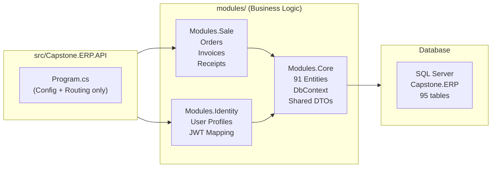

# Hoài Minh ERP - New Project Architecture

> Architecture and technical overview for the new Hoài Minh Honda ERP.
> For internal dev team presentations and documentation.

---

## 1. Overview

| Metric | Value |
|-----------|---------|
| **Framework** | .NET 10 (LTS) |
| **Architecture** | Modular Monolith + Vertical Slice |
| **Database** | SQL Server - Code-First (reverse-engineered from legacy DB) |
| **Authentication** | JWT Bearer - External Identity Server (`identity.Capstone.vn`) |
| **API Style** | Minimal API (No traditional Controllers) |
| **ORM** | Entity Framework Core 10 |
| **API Docs** | Swagger / OpenAPI (auto-generated) |

---

## 2. Directory Structure

```
Capstone.ERP/
|
--  .agent/                           AI Brain (not deployed)
|   -- agents/Capstone-analyst.md       AI Business Analyst
|   -- skills/Capstone-domain/          Domain knowledge (8 sections)
|   -- workflows/hm-feature.md         Auto feature pipeline
|
--  docs/                             Project Documents
|   -- requirements/                    Business Requirements
|
--  src/                              Host Application
|   -- Capstone.ERP.API/
|       -- Program.cs                   Entry point (config + routing only)
|       -- appsettings.json             Connection string, Auth config
|       -- Properties/
|           -- launchSettings.json      IIS Express + Kestrel profiles
|
--  modules/                          Business Logic (ALL code goes here)
|   -- Capstone.ERP.Modules.Core/      Shared: DbContext, Entities, DTOs
|   -- Capstone.ERP.Modules.Identity/  Auth: User Profiles, JWT mapping
|   -- Capstone.ERP.Modules.Sale/      Sales: Orders, Invoices, Receipts
|
-- Capstone.ERP.slnx                   Solution file
```

---

## 3. Architecture Philosophy

### "API is the Shell, Modules are the Heart"



### 3 Golden Rules:

1. **`src/Capstone.ERP.API/` contains NO business logic** - only server configuration and module registration
2. **Each module is self-contained** - Entity, DTO, Endpoint, Service
3. **Vertical Slice** - 1 feature = 1 neat folder, easy to navigate

---

## 4. Module Details

### `Modules.Core` - Foundation

```
Modules.Core/
-- Data/
|   -- CapstoneDbContext.cs           91 DbSets (all DB tables)
|   -- Entities/                      91 entity classes
|       -- tbl_SALOrderMaster.cs
|       -- tbl_CSWorkOrderMaster.cs
|       -- tbl_LSHead.cs
|       -- ... (91 files)
-- Common/
|   -- ApiResponse.cs                 Standard response wrapper
|   -- PaginatedRequest.cs            Pagination model
-- CoreModuleExtensions.cs            DI registration
```

**Role:** Provides entity classes + DbContext for all other modules to use.

### `Modules.Sale` - Sales Module

```
Modules.Sale/
-- Features/
|   -- Orders/
|   |   -- OrderEndpoints.cs          Order CRUD + API DTOs
|   -- OrderDetails/
|       -- OrderDetailEndpoints.cs    Order items + parts/services/promotions
-- SaleModuleExtensions.cs            Registers all endpoints
```

**API Endpoints:**

| Method | Path | Description |
|--------|------|--------|
| GET | `/api/v1/orders` | Order list (paged, filtered) |
| GET | `/api/v1/orders/{code}` | Order detail |
| POST | `/api/v1/orders` | Create order |
| PUT | `/api/v1/orders/{code}` | Update order |
| DELETE | `/api/v1/orders/{code}` | Delete order |
| GET | `/api/v1/orders/{code}/details` | Vehicles in order |
| GET | `/api/v1/order-details` | Detail item list |
| GET | `/api/v1/order-details/{code}/parts` | Parts in detail |
| GET | `/api/v1/order-details/{code}/services` | Services in detail |
| GET | `/api/v1/order-details/{code}/promotions` | Promotions in detail |

### `Modules.Identity` - Auth & User Profiles

```
Modules.Identity/
-- Features/
|   -- UserProfile/
|       -- UserProfileEndpoints.cs    /me + profiles CRUD
-- IdentityModuleExtensions.cs
```

**API Endpoints:**

| Method | Path | Description |
|--------|------|--------|
| GET | `/api/v1/users/me` | Current profile (from JWT token) |
| GET | `/api/v1/users/profiles` | Profile list |
| GET | `/api/v1/users/profiles/{code}` | Specific profile |

---

## 5. Old vs New Comparison

| Metric | Old (.NET 4.7.2) | New (.NET 10) |
|----------|------------------|---------------|
| **Framework** | .NET Framework 4.7.2 | .NET 10 |
| **API Pattern** | `ApiController` + `IHttpActionResult` | Minimal API |
| **Data Access** | EDMX Database-First | EF Core Code-First |
| **Auth** | `ScopeAuthorize` (Lib3P) | JWT Bearer (built-in) |
| **Request/Response** | `dynamic param` -> JSON manual deserialize | Strongly-typed DTOs |
| **Error Handling** | `ReturnSuccess/ReturnError` | `Results.Ok/BadRequest` + `ApiResponse<T>` |
| **Dependencies** | Lib3P (custom library) | NuGet packages only |
| **API Docs** | None | Auto Swagger |
| **Code Structure** | 51 partial controller files | Vertical Slice (1 folder = 1 feature) |
| **Commented Code** | ~90% commented out | 0% - clean codebase |

---

## 6. Developer Guidelines

### Adding a New Feature (e.g. Customer Service)

```
# Step 1: Create new module
modules/Capstone.ERP.Modules.CustomerService/

# Step 2: Create feature folder
Features/WorkOrders/WorkOrderEndpoints.cs

# Step 3: Create module extension
CustomerServiceModuleExtensions.cs

# Step 4: Register in Program.cs
app.MapCustomerServiceModuleEndpoints();
```

### Run & Test

```bash
# Run dev server
dotnet run --project src/Capstone.ERP.API

# Or F5 in Visual Studio -> IIS Express
# Swagger UI available at: http://localhost:5200/swagger
```

### AI Assistance Commands

| Command | Description |
|-------|--------|
| `/hm-feature {req}` | Auto analyze business logic + write code |
| `/plan {description}` | Plan feature before coding |
| `/debug` | Debug errors |
| `/test {description}` | Generate test cases |

---

## 7. Module Roadmap

| Priority | Module | Description | Tables |
|----------|--------|--------|--------|
| Next | `Modules.CustomerService` | Maintenance & repair | `tbl_CS*` (17 tables) |
| Next | `Modules.Warehouse` | Warehouse, stock | `tbl_WH*`, `tbl_SIO*` (15 tables) |
| Later | `Modules.HR` | Human resources | `tbl_HR*` (6 tables) |
| Last | `Modules.Report` | Reporting | Read-only queries |
| Last | `Modules.Dashboard` | Main dashboard | Aggregation queries |

> Entities for **all 91 tables** are ready in `Modules.Core/Data/Entities/`. Just create Endpoints in the new modules.
