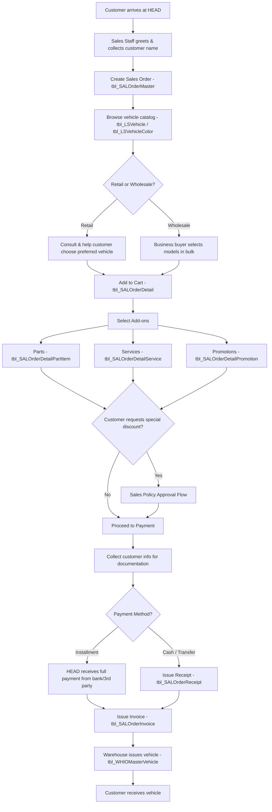

# Sales Flow - Vehicle Sales Process at Honda HEAD Hoài Minh

## Overview

The vehicle sales process at HEAD is a multi-step journey from customer greeting to vehicle delivery. It involves Sales Staff, Store Manager, Sales Director, Director, Cashier, and Warehouse.

## Complete Sales Flow Diagram

## Step-by-Step Breakdown

### Step 1: Customer Greeting & Order Creation

**Actor:** Sales Staff (NV Sale)

- Sales Staff approaches and greets the customer
- Collects **customer name only** at first (to avoid making customers uncomfortable by asking for phone number immediately)
- Creates a new Sales Order (`tbl_SALOrderMaster`) with:
  - `CustomerName` (minimum required)
  - `SaleStaff` = current employee ID
  - `HeadOut` = current HEAD Code
  - `SaleDate` = current datetime
  - `Status` = initial status (Created)
  - `TypeData` = retail or wholesale indicator

> **UX Insight:** Asking for phone number too early makes customers feel pressured. Name is sufficient to create the order. Phone/address collected later during documentation phase.

### Step 2: Vehicle Consultation & Selection

**Actor:** Sales Staff

- Navigate vehicle catalog grouped by `tbl_LSTypeOfVehicle` (category)
- Each vehicle model (`tbl_LSVehicle`) has:
  - Multiple colors (`tbl_LSVehicleColor`) with individual pricing
  - Specifications (`tbl_LSVehicleSpecs`)
  - Stock levels (`tbl_LSVehicleColorStock`) per warehouse
- **Retail flow:** Personalized consultation, help customer find the "perfect" bike
- **Wholesale flow:** Business buyer typically knows what they want, selects in bulk

### Step 3: Cart Management

**Actor:** Sales Staff

- Selected vehicles are added to `tbl_SALOrderDetail`:
  - Links to `tbl_SALOrderMaster` (parent order)
  - Each detail line = 1 vehicle selection
- Can add/remove vehicles from cart before finalizing

### Step 4: Add-ons Selection (Parts, Services, Promotions)

**Actor:** Sales Staff

For each vehicle in the cart, customer can choose:

1. **Parts**  `tbl_SALOrderDetailPartItem`
   - Accessories, add-on parts (e.g., windshield, floor mat, phone holder)
   - Quantity, UnitPrice tracked per item

2. **Services**  `tbl_SALOrderDetailService`
   - Additional services (e.g., free first maintenance, extended warranty)
   - Linked to `tbl_CSServiceMaster` catalog

3. **Promotions**  `tbl_SALOrderDetailPromotion`
   - Applied from `tbl_POLPromotionMaster` (approved policies only)
   - `DiscountPercentage` or `DiscountAmount`
   - `PromotionType` differentiates discount vs gift

### Step 5: Special Discount Request (If Needed)

**Trigger:** Customer negotiates (e.g., "This display bike has scratches, can I get VND 2M off?")

 See `08-approval-flows.md` for the complete Approval Flow.

**Summary:**
1. Sales Staff asks Store Manager (CHT)
2. CHT creates Policy Voucher (`tbl_POLPromotionMaster`, Status=Draft)
3. CHT sends to Sales Director (TPKD) for review
4. TPKD may adjust -> forwards to Director (G)
5. G final approval or rejection
6. If approved, Sale applies voucher to order

### Step 6: Customer Documentation

**Actor:** Reception Staff / Sales Staff

- Collect comprehensive customer information:
  - Full name, phone, address, citizen ID (`CitizenCardNo`)
  - Gender, birth date, occupation
  - Stored in `tbl_CSLoyalCustomer` (creates loyalty profile)
  - `tbl_SALOrderMaster.Customer` links to loyal customer

> **Business Logic:** Documentation happens BEFORE payment collection. Customer must have a complete profile before receiving receipt/invoice.

### Step 7: Payment Processing

**Actor:** Cashier / authorized Sales Staff

Three payment methods (`tbl_SALOrderMaster.PaymentMethod`):

| Method | Flow | Receipt Timing |
|--------|------|----------------|
| **Installment** | Bank/3rd-party pays HEAD full amount | Invoice issued immediately |
| **Full Payment** | Receipt -> then Invoice | Receipt first, Invoice after receipt completes |
| **Deposit** | Partial receipt -> rest later | Receipt per payment, Invoice when fully paid |

- **Receipt** (`tbl_SALOrderReceipt`):
  - `Cashier` = staff collecting payment
  - `CollectedAmount` = amount received
  - `PaymentMethod` = cash or bank transfer
  - `Status` tracks completion
  
- **Invoice** (`tbl_SALOrderInvoice`):
  - Generated AFTER receipt is complete (for Cash/Transfer)
  - Generated IMMEDIATELY for installment
  - Contains VAT info (`VATCustomerName`, `VATCompanyTax`, etc.)

### Step 8: Vehicle Delivery

**Actor:** Warehouse Manager

- System triggers stock-out via `tbl_WHIOMasterVehicle` / `tbl_SIOMasterVehicle`
- Vehicle is deducted from `tbl_LSVehicleColorStock`
- Physical vehicle handed to customer

## Alternative Flows

### Flow A: Vehicle Transfer Between HEADs

When current HEAD has no stock:
1. Sales Staff contacts another HEAD's manager
2. If approved, source HEAD creates transfer document (`tbl_WHIOMasterVehicle` with transfer type)
3. Vehicle physically moved to destination HEAD
4. Sale continues at destination HEAD

### Flow B: Vehicle Reservation

When no stock available anywhere:
1. Customer signs a pre-order contract
2. HEAD orders from Honda factory/distributor (`tbl_PURDOMaster`)
3. Customer pays deposit
4. When vehicle arrives  standard delivery flow resumes
5. Customer notified via phone/SMS to pick up

### Flow C: Revenue Recording

After invoice completion:
- System records in `tbl_REVMasterVehicle` (revenue master)
- Detail entries in `tbl_REVDetailVehicle` (debit/credit lines)
- Used for financial reporting
