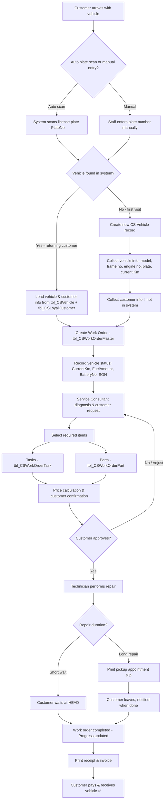

# Service Flow - Maintenance & Repair Process at Honda HEAD Hoài Minh

## Overview

The service flow handles vehicle maintenance (bảo dưỡng) and repair (sửa chữa) at HEAD. It starts from vehicle arrival, through diagnosis, parts/service selection, repair execution, to payment and vehicle return.

## Complete Service Flow Diagram



## Step-by-Step Breakdown

### Step 1: Vehicle Arrival & Identification

**Actor:** Reception Staff / KTV / Automatic Scanner

- **Automatic scanning:** When vehicle passes entry point, system reads license plate
  - Reason: KTV's hands may be dirty from repairs, can't handle reception
  - Any staff or automated machine can handle this step
- **Manual entry:** Staff types plate number if scanner unavailable

**System lookup:**
```
Query tbl_CSVehicle WHERE PlateNo = scanned_plate
-> Found: Load full vehicle history + owner info
-> Not Found: Create new CSVehicle record
```

### Step 2: Vehicle Registration (New Vehicles)

**Actor:** Reception Staff

If vehicle is not in system (`IsNewCSVehicle = true`):
- Collect vehicle details:
  - `FrameSeri` (Số khung)
  - `EngineSeri` (Số máy)
  - `PlateNo` (Biển số)
  - `VehicleColor` -> links to `tbl_LSVehicleColor`
  - `CurrentKm`
- Collect customer info -> create/update `tbl_CSLoyalCustomer`
- Determine maintenance count (bảo dưỡng lần thứ mấy)

### Step 3: Work Order Creation

**Actor:** Service Consultant / KTV

Create `tbl_CSWorkOrderMaster`:

| Field | Description |
|-------|-------------|
| `Head` | Current HEAD branch |
| `WorkOrderNo` | Auto-generated work order number |
| `LoyalCustomer` | Link to customer profile |
| `CSVehicle` | Link to vehicle record |
| `TypeOfWorkOrder` | Type (periodic maintenance, repair, warranty...) |
| `CurrentKm` | Odometer reading at service entry |
| `FuelType` | Fuel type (gasoline, electric) |
| `FuelAmount` | Current fuel level (liters) |
| `BatteryNo` | Battery serial (for electric vehicles) |
| `SOH` | State of Health (battery %) |
| `ReceivingTime` | When vehicle was received |
| `EstimateReturnTime` | Estimated completion time |
| `Consultant` | Service consultant staff ID |
| `TechnicalConsultant` | Technical advisor staff ID |
| `TechnicalRepair` | Assigned repair technician |
| `CustomerRequest` | Customer's description of issues |
| `ConsultantRemark` | Consultant's diagnosis notes |
| `Progress` | Status tracking (see Status section) |

### Step 4: Service & Parts Selection

**Actor:** Service Consultant / KTV

**Tasks** (`tbl_CSWorkOrderTask`):
- Select from task bank (`tbl_CSTaskBank`) -- predefined service tasks
- Each task has: `TypeOfTask`, `Quantity`, `UnitPrice`
- `StatusChecked` tracks if task was performed

**Parts** (`tbl_CSWorkOrderPart`):
- Select parts needed for repair
- `TypeOfPart` -> `tbl_LSTypeOfPart` (part category)
- `TypeOfPartSpecs` -> `tbl_LSTypeOfPartSpecs` (part specification)
- `PartItem` -> `tbl_LSPartItem` (actual inventory item)
- `Quantity`, `UnitPrice`
- `StatusChecked` tracks if part was used
- `OrderTask` links part to its parent task

**Service Packages** (`tbl_CSServiceMaster`):
- Pre-configured service packages (e.g., "10,000km maintenance package")
- Contains predefined tasks (`tbl_CSServiceTask`) and parts (`tbl_CSServicePart`)
- Can be vehicle-specific via `tbl_CSServiceVehicle`
- Has warranty parameters: `WarrantyKm`, `WarrantyDuration`

### Step 5: Repair Execution

**Actor:** KTV (Technician)

- Performs the actual repair/maintenance work
- Updates `StatusChecked` on tasks and parts as completed
- Progress status updates on `tbl_CSWorkOrderMaster.Progress`

### Step 6: Wait or Appointment

**Decision point:** Estimated repair duration

| Scenario | Action |
|----------|--------|
| Short repair (< 1 hour) | Customer waits at HEAD lounge |
| Long repair (> 1 hour) | Print appointment slip with `EstimateReturnTime` |
| Very long / parts unavailable | Customer receives phone call when ready |

- `EstimateReturnTime` and `RealReturnTime` tracked in work order
- `tbl_CSMSSendMaster` / `tbl_CSMSSendDetails` for automated notifications

### Step 7: Completion & Payment

**Actor:** Cashier / authorized staff

1. Work order status -> "Completed" (Hoàn tất)
2. Print receipt for payment
3. Payment collection (same flow as Sales receipts/invoices)
4. Vehicle returned to customer
5. `RealReturnTime` recorded

### Step 8: Post-Service (Customer Care)

**Actor:** CSKH

- System tracks next maintenance milestone:
  - Based on `CurrentKm` + standard interval (e.g., +4,000km)
  - Based on date + standard interval (e.g., +6 months)
- Automated SMS/Zalo reminders via:
  - `tbl_CSMSAutoConfig` (auto-trigger configuration)
  - `tbl_CSMSTemplate` (message templates for Zalo/SMS)
  - `tbl_CSMSSendMaster` -> `tbl_CSMSSendDetails` (batch send tracking)
  - `tbl_CSMSMapping` (customer-to-message mapping)

## Work Order Status Flow (Progress values in `tbl_LSStatus`, TypeData=13)

| Code | Status | Meaning |
|------|--------|---------|
| 69 | Tiếp nhận xe | Vehicle received at HEAD |
| 70 | Tiếp nhận khách | Customer reception completed |
| 71 | Chờ giao xe | Waiting for vehicle return to customer |
| 72 | Hoàn tất | Work order completed |

## Customer Loyalty Tracking

- `tbl_CSVehicleLoyalty` links vehicles to loyal customers
  - `IsCurrent` = current owner flag (vehicles can change owners)
  - `LastTrading` = last service date
  - `LastWorkOrder` = most recent work order
- Used to track complete service history per vehicle across all HEADs
