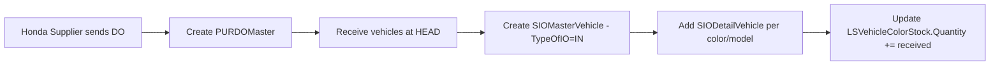
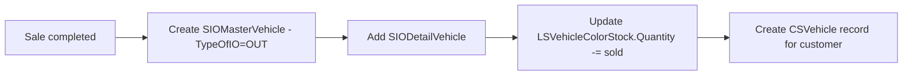
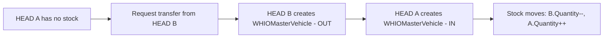
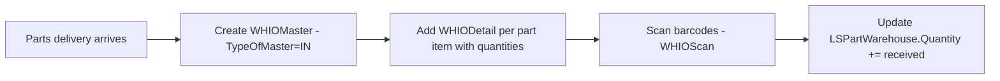

# Warehouse Flow - Stock Management at Honda HEAD Hoài Minh

## Overview

Warehouse management handles two distinct inventory types: **Vehicles** and **Parts**. Each has separate tables and flows but shares common warehouse infrastructure.

## Warehouse Structure

```
tbl_LSHead (HEAD/Branch)
-- tbl_LSWarehouse (Warehouse per HEAD)
    -- tbl_WHZone (Zones within warehouse)
        -- tbl_WHLocation (Locations within zone)
```

- Each HEAD can have multiple warehouses
- Each warehouse is divided into zones and locations for precise item positioning

## Vehicle Stock Flow

### Vehicle Stock Tables

| Table | Purpose |
|-------|---------|
| `tbl_LSVehicle` | Vehicle model master (name, type, specs) |
| `tbl_LSVehicleColor` | Model + Color combination with pricing |
| `tbl_LSVehicleColorStock` | **Current stock** per VehicleColor per Warehouse |
| `tbl_SIOMasterVehicle` | Stock In/Out transaction master |
| `tbl_SIODetailVehicle` | Stock In/Out transaction details |
| `tbl_SIOCurrentVehicle` | Current vehicle stock snapshot |

### Vehicle Stock In



### Vehicle Stock Out (Sales)



### Vehicle Transfer Between HEADs



Key fields in `tbl_WHIOMasterVehicle`:
- `OutWH` = source warehouse
- `InWH` = destination warehouse
- `TypeOfMaster` determines transfer type
- `DO` links to purchase delivery order if applicable

## Parts Stock Flow

### Parts Stock Tables

| Table | Purpose |
|-------|---------|
| `tbl_LSPartItem` | Part item master |
| `tbl_LSPartCategory` | Part categories |
| `tbl_LSTypeOfPart` | Part type classification |
| `tbl_LSTypeOfPartSpecs` | Part specs per type |
| `tbl_LSPartItemVehicle` | Parts compatible with specific vehicles |
| `tbl_LSPartItemLocation` | Part storage location in warehouse |
| `tbl_LSPartWarehouse` | **Current stock** per part per warehouse |
| `tbl_WHIOMaster` | Stock In/Out master for parts |
| `tbl_WHIODetail` | Stock In/Out detail per part item |
| `tbl_WHIOScan` | Barcode scan records during stock operations |

### Parts Stock In



Key fields:
- `WHIOMaster.Supplier` = supplier partner
- `WHIODetail.Quantity` = ordered qty
- `WHIODetail.ConfirmQuantity` = confirmed received qty
- `WHIODetail.ReceivedQuantity` = actual received qty
- `WHIODetail.IsNew` = new item flag

### Parts Stock Out (for Service/Repair)

When Technician uses parts during repair:
1. Parts selected in `tbl_CSWorkOrderPart`
2. System creates corresponding `WHIOMaster` / `WHIODetail` for stock-out
3. `LSPartWarehouse.Quantity` decremented

### Parts Pricing

`tbl_LSPartWarehouse` tracks:
- `AvgPriceTime` = time-weighted average price
- `AvgPriceMonth` = monthly average price
- Used for cost calculation in repairs

## Inventory Audit

### Audit Hierarchy

```
tbl_WHInventoryMaster (Audit campaign)
-- tbl_WHInventoryPoint (Audit points - per warehouse)
    -- tbl_WHInventorySession (Count sessions)
        -- tbl_WHInventory (Individual count records)
            -- tbl_WHInventoryScan (Scan records)
```

### Audit Flow

1. **Create Master** (`tbl_WHInventoryMaster`): Define audit campaign with date range
2. **Assign Points** (`tbl_WHInventoryPoint`): Select warehouses & assign staff
3. **Assign Staff** (`tbl_WHInventoryStaff`): Staff members for each point
4. **Count Sessions** (`tbl_WHInventorySession`): Multiple count rounds
5. **Scan & Count** (`tbl_WHInventoryScan`): Barcode scanning with quantities
6. **Compare** (`tbl_WHInventoryStock`): Compare system stock vs physical count
7. **Reconcile**: Adjust discrepancies

### Audit Status Flow (TypeData=3)

| Code | Status |
|------|--------|
| 10 | Planning |
| 11 | Counting |
| 12 | Completed |
| 13 | Cancelled |

## Stock Lock Mechanism

`tbl_LSVehicleColorStock.Lock` - Number of vehicles "locked" (reserved but not yet delivered):
- When a sales order selects a vehicle -> `Lock` increments
- When sale is cancelled -> `Lock` decrements
- Available stock = `Quantity - Lock`

> **Business Rule:** System must prevent selling more vehicles than available (`Quantity - Lock > 0`).
