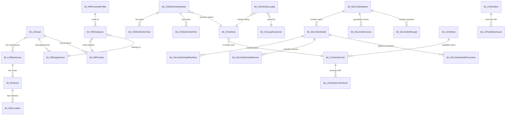

# Database Schema - Honda HEAD Hoài Minh ERP

## Database Overview

- **Server:** SQL Server
- **Database:** `HOAIMINH.ERP`
- **Total Tables:** 95
- **Naming Convention:** `tbl_{Module}{EntityName}` (e.g., `tbl_SALOrderMaster`)

## Entity Relationship Diagram (Core)

## Module: Sales (SAL) - 9 Tables

### tbl_SALOrderMaster (Sales Order Header)
| Column | Type | PK | Nullable | Description |
|--------|------|:--:|:--------:|-------------|
| Code | bigint |  | NO | Primary key |
| ID | nvarchar(30) | - | NO | Order display ID |
| UserID | int | - | YES | Creating user |
| Customer | bigint | - | YES | FK  tbl_CSLoyalCustomer |
| IsNewCustomer | bit | - | YES | First-time customer flag |
| Partner | bigint | - | YES | FK  tbl_LSPartner (wholesale buyer) |
| SaleDate | datetime | - | YES | Transaction date |
| SaleStaff | int | - | YES | FK  tbl_HREmployee |
| AmountPaid | float | - | YES | Total paid amount |
| PaymentMethod | int | - | YES | Payment type code |
| PaymentCount | int | - | YES | Number of payments made |
| TypeData | int | - | NO | Order type (retail/wholesale) |
| Status | int | - | NO | FK  tbl_LSStatus |
| HeadOut | bigint | - | NO | FK  tbl_LSHead (selling branch) |
| WHOut | bigint | - | YES | FK  tbl_LSWarehouse |
| CustomerName | nvarchar(500) | - | YES | Quick-entry customer name |
| CustomerGender | int | - | YES | Gender code |
| CustomerNeeds | nvarchar(MAX) | - | YES | Customer requirements notes |
| CustomerCharacteristics | nvarchar(MAX) | - | YES | Customer trait notes |
| CustomerExpectation | nvarchar(MAX) | - | YES | What customer expects |
| CustomerPreferences | nvarchar(MAX) | - | YES | Customer preferences |
| CustomerNotes | nvarchar(MAX) | - | YES | Additional notes |
| SIOMasterVehicle | bigint | - | YES | FK  stock out reference |

### tbl_SALOrderDetail (Order Line Items)
| Column | Type | Description |
|--------|------|-------------|
| Code | bigint (PK) | Primary key |
| OrderMaster | bigint | FK  tbl_SALOrderMaster |
| VehicleColor | bigint | FK  tbl_LSVehicleColor |
| CSVehicle | bigint | FK  tbl_CSVehicle (specific unit) |
| UnitPrice | float | Price of vehicle |
| Quantity | int | Number of units |
| TypeData | int | Line type |

### tbl_SALOrderDetailPartItem (Add-on Parts)
| Column | Type | Description |
|--------|------|-------------|
| Code | bigint (PK) | Primary key |
| OrderDetail | bigint | FK  tbl_SALOrderDetail |
| PartItem | bigint | FK  tbl_LSPartItem |
| Quantity | int | Quantity |
| UnitPrice | float | Unit price |
| BaseUnit | int | Base unit of measure |

### tbl_SALOrderDetailService / tbl_SALOrderDetailPromotion
- Similar structure linking services and promotions to order details
- Promotion includes `DiscountPercentage`, `DiscountAmount`, `PromotionType`

### tbl_SALOrderInvoice (Invoice)
| Column | Type | Description |
|--------|------|-------------|
| Code | bigint (PK) | Primary key |
| Head | bigint | FK  tbl_LSHead |
| OrderMaster | bigint | FK  tbl_SALOrderMaster |
| InvoiceNo / InvoiceSerial | nvarchar | Invoice identifiers |
| TotalAmount | float | Invoice total |
| VATAmount | float | VAT tax amount |
| VATCustomer* / VATCompany* | - | VAT recipient info |
| TypeData | int | Invoice type |
| Status | int | Invoice status |

### tbl_SALOrderReceipt (Payment Receipt)
| Column | Type | Description |
|--------|------|-------------|
| Code | bigint (PK) | Primary key |
| Head | bigint | FK  tbl_LSHead |
| OrderMaster | bigint | FK  tbl_SALOrderMaster |
| Cashier | int | FK  tbl_HREmployee |
| CollectedAmount | float | Amount collected |
| PaymentMethod | int | Cash / Bank transfer |
| Customer / CustomerName | - | Customer reference |
| Signature | nvarchar(MAX) | Digital signature |
| Status | int | Receipt status |

## Module: Customer Service (CS) - 16 Tables

### tbl_CSWorkOrderMaster (Work Order)
See `04-service-flow.md` for full field documentation.

### tbl_CSVehicle (Customer Vehicle Registry)
| Column | Type | Description |
|--------|------|-------------|
| Code | bigint (PK) | Primary key |
| VehicleColor | bigint | FK  tbl_LSVehicleColor |
| FrameSeri | nvarchar(50) | Chassis/frame number |
| EngineSeri | nvarchar(50) | Engine number |
| PlateNo | nvarchar(50) | License plate |
| CurrentKm | int | Latest odometer reading |
| InsuranceNumber | nvarchar(100) | Insurance policy number |
| TradeDate | datetime | Purchase date |
| WarrantyKm | int | Warranty Km limit |
| WarrantyDate | datetime | Warranty expiry date |
| CurrentPoint | float | Loyalty points |
| Status | int | Vehicle status |

### tbl_CSLoyalCustomer (Customer Profile)
| Column | Type | Description |
|--------|------|-------------|
| Code | bigint (PK) | Primary key |
| CardNo | nvarchar(10) | Loyalty card number |
| FullName | nvarchar(500) | Full name |
| BirthDate | datetime | Date of birth |
| Gender | int | Gender code |
| Province/District/Ward | int | Address references |
| Address / FullAddress | nvarchar | Address text |
| Cellphone1/2/3 | nvarchar(15) | Up to 3 phone numbers |
| Email | nvarchar(200) | Email address |
| Occupation | int | Occupation code |
| FirstHead | bigint | First HEAD visited |
| CitizenCardNo | nvarchar(20) | Citizen ID (CCCD/CMND) |
| Zalo | nvarchar(15) | Zalo account |
| MyHonda / OA | int | MyHonda app / OA follow status |

## Module: Master Data (LS) - 20 Tables

### Key Master Tables

| Table | Purpose | Key Fields |
|-------|---------|------------|
| `tbl_LSHead` | Branch registry | HeadID, BriefName, TradeName, ReportToHead |
| `tbl_LSVehicle` | Vehicle models | VehicleName, TypeOfVehicle, Version, Engine |
| `tbl_LSVehicleColor` | Model + Color | Vehicle, ColorName, Price, AmountPaid |
| `tbl_LSVehicleColorStock` | Vehicle stock | Warehouse, VehicleColor, Quantity, Lock |
| `tbl_LSPartItem` | Part items | PartName, Barcode, Category |
| `tbl_LSPartWarehouse` | Part stock | PartItem, Warehouse, Quantity, AvgPrice |
| `tbl_LSPartner` | Business partners | Name, Address, Tax info, Bank info |
| `tbl_LSWarehouse` | Warehouses | Head, WHCode, WHName, Address |
| `tbl_LSStatus` | Status definitions | StatusName, TypeOfStatus, TypeData |
| `tbl_LSList` | Generic lookup lists | Parent-child hierarchy for dropdowns |

## Module: System (SYS) - 12 Tables

| Table | Purpose |
|-------|---------|
| `tbl_SYSRoles` | Role definitions |
| `tbl_SYSStaffInRoles` | Staff-Role assignments (per HEAD) |
| `tbl_SYSPermissions` | Action-level permissions |
| `tbl_SYSDataPermissions` | Data-level permissions |
| `tbl_SYSModule` | System modules (Sale, Warehouse, HR...) |
| `tbl_SYSFunction` | Functions within modules |
| `tbl_SYSAction` | Actions within functions |
| `tbl_SYSAPI` | API endpoint registry |
| `tbl_SYSData` | System configuration data |
| `tbl_SYSGUID` | GUID generation |
| `tbl_SYSIncrease` | Auto-increment sequences |
| `tbl_SYSMachine` | Registered devices |

## Module: Warehouse (WH) - 13 Tables

See `05-warehouse-flow.md` for detailed flow.

## Module: HR - 4 Tables

| Table | Purpose | Key Fields |
|-------|---------|------------|
| `tbl_HRPersonalProfile` | Personal info (name, ID, credentials) | FullName, IdentityNo, UserName, MainHead |
| `tbl_HREmployee` | Employment records | Head, Position, Department, StaffID |
| `tbl_HRDepartment` | Departments per HEAD | DepartmentID, Department |
| `tbl_HRPosition` | Positions per HEAD | Position, IsSupervisor, IsLeader, ReportTo |

## Common Field Patterns

All tables follow these conventions:
- `Code` (bigint/int) = Primary Key (auto-increment)
- `TypeData` (int) = Sub-type discriminator (e.g., retail=1, wholesale=3)
- `Status` / `StatusID` (int) = FK  tbl_LSStatus
- `CreateBy` / `CreatedBy` (nvarchar 100) = Who created
- `CreateTime` / `CreatedTime` (datetime) = When created
- `LastModifiedBy` (nvarchar 100) = Last editor
- `LastModifiedTime` (datetime) = Last edit timestamp

> **Note on naming inconsistency:** Some tables use `CreateBy`/`CreateTime`, others use `CreatedBy`/`CreatedTime`. Both are valid; the database has legacy naming variations.
