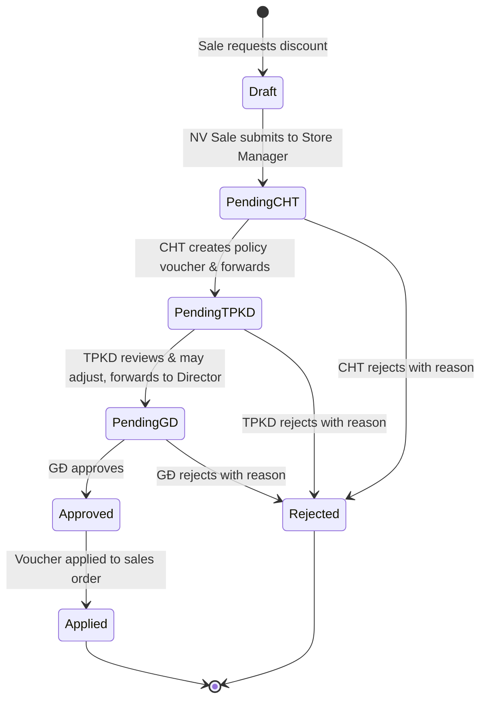
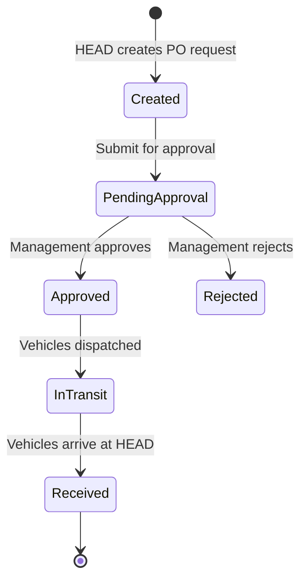
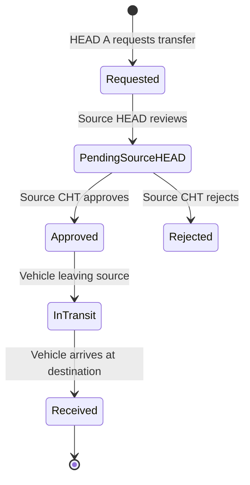
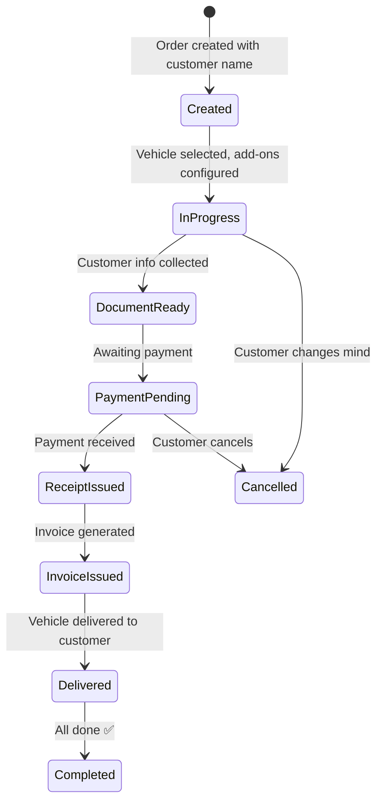
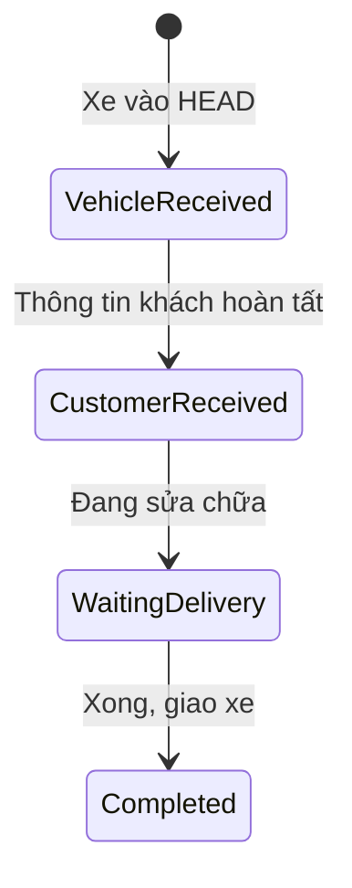
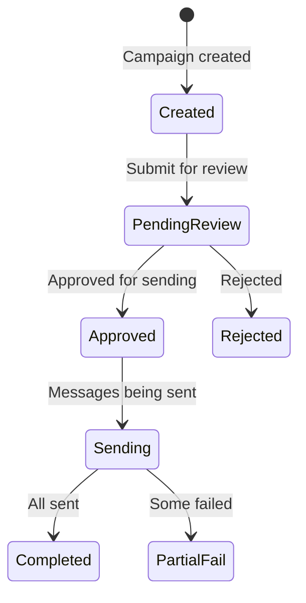

# Approval Flows - Multi-Level Approval at Honda HEAD Hoài Minh

## Overview

Several business operations at Hoài Minh require multi-level approval before execution. This document defines each approval flow, the actors involved, and the status transitions.

## Flow 1: Sales Policy / Special Discount Approval

**Trigger:** Customer requests a discount not covered by active promotions (e.g., "Display bike has scratches, give me VND 2M off")

### Actors & Responsibilities

| Step | Actor | Action | DB Operation |
|------|-------|--------|--------------|
| 1 | NV Sale | Verbally requests discount from CHT | None (offline) |
| 2 | CHT | Creates `tbl_POLPromotionMaster` with Status=`Draft` | INSERT |
| 3 | CHT | Submits to TPKD | UPDATE Status -> `Pending` |
| 4 | TPKD | Reviews, may adjust amounts | UPDATE fields + forward |
| 5 | GĐ | Final approval or rejection | UPDATE Status -> `Approved` or `Rejected` |
| 6 | NV Sale | Applies approved voucher to order | INSERT `tbl_SALOrderDetailPromotion` |

### Status Values (`tbl_LSStatus`, TypeData=1)

| Code | Status | Meaning |
|------|--------|---------|
| 1 | Tạo mới | Draft - Just created |
| 2 | Gửi duyệt | Submitted for approval |
| 3 | Duyệt | Approved |
| 4 | Ngưng áp dụng | Suspended/Deactivated |
| 5 | Trả về | Returned for revision |
| 20 | Không duyệt | Rejected |

### Business Rules

- NV Sale **CANNOT** see `Draft` status policies
- Only `Approved` + within `StartDate`/`EndDate` policies are visible to Sale
- Rejection **MUST** include a reason (stored in Description)
- Approved policies are **IMMUTABLE** -- to change, create new version

## Flow 2: Purchase Order Approval (DO - Delivery Order)

**Trigger:** HEAD needs to order vehicles from Honda distributor

### Status Values (`tbl_LSStatus`, TypeData=4)

| Code | Status | Meaning |
|------|--------|---------|
| 15 | Tạo mới | Created |
| 16 | Đang đề nghị | Pending approval |
| 17 | Chờ giao nhận | Waiting for delivery |
| 18 | Đang giao nhận | In delivery |
| 19 | Hoàn tất | Completed |

## Flow 3: Warehouse Transfer Approval

**Trigger:** HEAD A requests vehicles from HEAD B

## Flow 4: Sales Order Status Flow

**The main order lifecycle:**

### Sales Order Status Values (`tbl_LSStatus`, TypeData=7)

| Code | Status | Meaning |
|------|--------|---------|
| 27 | Tạo mới | Order created |
| 28 | Chờ giao xe | Waiting for vehicle delivery |
| 30 | Hoàn tất | Completed |
| 31 | Đã hủy | Cancelled |

## Flow 5: Work Order (Service) Status Flow

### Work Order Status Values (`tbl_LSStatus`, TypeData=13)

| Code | Status | Meaning |
|------|--------|---------|
| 69 | Tiếp nhận xe | Vehicle received |
| 70 | Tiếp nhận khách | Customer received |
| 71 | Chờ giao xe | Pending vehicle return |
| 72 | Hoàn tất | Completed |

## Flow 6: SMS/Notification Campaign Approval

### SMS Status Values (`tbl_LSStatus`, TypeData=14)

| Code | Status | Meaning |
|------|--------|---------|
| 73 | Tạo mới | Created |
| 74 | Gửi duyệt | Submitted for review |
| 75 | Không duyệt | Rejected |
| 76 | Chờ gửi tin | Waiting to send |
| 77 | Ngưng gửi tin | Stopped |
| 78 | Hoàn tất | Completed |

## General Approval Principles

1. **Hierarchy must be respected:** Lower levels cannot bypass higher-level approvals
2. **Every status change must be auditable:** `LastModifiedBy` + `LastModifiedTime` recorded
3. **Rejections require reasons:** Always store rejection rationale
4. **Approved items are immutable:** Create new versions instead of modifying
5. **Status transitions are one-directional:** Cannot go backwards except via explicit "Return" (Trả về) action
