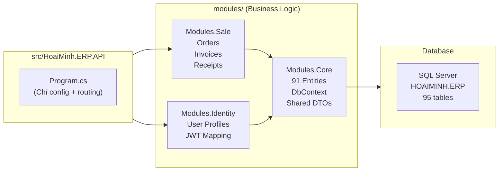

# Hoài Minh ERP — Kiến Trúc Dự Án Mới

> Tài liệu giới thiệu cấu trúc kỹ thuật dự án Hoài Minh Honda ERP (phiên bản mới).
> Phục vụ thuyết trình nội bộ cho team dev.

---

## 1. Tổng Quan

| Thông tin | Giá trị |
|-----------|---------|
| **Framework** | .NET 10 (LTS) |
| **Kiến trúc** | Modular Monolith + Vertical Slice |
| **Database** | SQL Server — Code-First (reverse-engineered từ DB hiện tại) |
| **Authentication** | JWT Bearer — External Identity Server (`identity.hoaiminh.vn`) |
| **API Style** | Minimal API (không dùng Controller cũ) |
| **ORM** | Entity Framework Core 10 |
| **API Docs** | Swagger / OpenAPI (tự động từ code) |

---

## 2. Cấu Trúc Thư Mục

```
HoaiMinh.ERP/
│
├── 📁 .agent/                          ← Bộ não AI (không deploy)
│   ├── agents/hoaiminh-analyst.md      ← AI Business Analyst
│   ├── skills/hoaiminh-domain/         ← Domain knowledge (8 sections)
│   └── workflows/hm-feature.md        ← Auto feature pipeline
│
├── 📁 docs/                            ← Tài liệu dự án
│   └── requirements/                   ← Yêu cầu nghiệp vụ
│
├── 📁 src/                             ← Host Application
│   └── HoaiMinh.ERP.API/
│       ├── Program.cs                  ← Entry point (chỉ config + routing)
│       ├── appsettings.json            ← Connection string, Auth config
│       └── Properties/
│           └── launchSettings.json     ← IIS Express + Kestrel profiles
│
├── 📁 modules/                         ← Business Logic (TẤT CẢ code ở đây)
│   ├── HoaiMinh.ERP.Modules.Core/     ← Shared: DbContext, Entities, DTOs
│   ├── HoaiMinh.ERP.Modules.Identity/ ← Auth: User Profiles, JWT mapping
│   └── HoaiMinh.ERP.Modules.Sale/     ← Bán hàng: Orders, Invoices, Receipts
│
└── HoaiMinh.ERP.slnx                  ← Solution file
```

---

## 3. Triết Lý Kiến Trúc

### ⚡ "API là cái Vỏ, Modules là trái Tim"



### 3 Nguyên Tắc Vàng:

1. **`src/HoaiMinh.ERP.API/` không chứa logic nghiệp vụ** — chỉ cấu hình server và đăng ký modules
2. **Mỗi module tự chứa mọi thứ** — Entity, DTO, Endpoint, Service
3. **Vertical Slice** — 1 feature = 1 folder gọn gàng, dễ tìm

---

## 4. Chi Tiết Từng Module

### 📦 `Modules.Core` — Nền Tảng Dùng Chung

```
Modules.Core/
├── Data/
│   ├── HoaiMinhDbContext.cs          ← 91 DbSets (tất cả bảng DB)
│   └── Entities/                     ← 91 entity classes
│       ├── tbl_SALOrderMaster.cs
│       ├── tbl_CSWorkOrderMaster.cs
│       ├── tbl_LSHead.cs
│       └── ... (91 files)
├── Common/
│   ├── ApiResponse.cs                ← Chuẩn response wrapper
│   └── PaginatedRequest.cs           ← Phân trang
└── CoreModuleExtensions.cs           ← DI registration
```

**Vai trò:** Cung cấp entity classes + DbContext cho tất cả modules khác sử dụng.

### 🛒 `Modules.Sale` — Phân hệ Bán Hàng

```
Modules.Sale/
├── Features/
│   ├── Orders/
│   │   └── OrderEndpoints.cs         ← CRUD đơn hàng + API DTOs
│   └── OrderDetails/
│       └── OrderDetailEndpoints.cs   ← Chi tiết đơn + parts/services/promotions
└── SaleModuleExtensions.cs           ← Đăng ký tất cả endpoints
```

**API Endpoints:**

| Method | Path | Mô tả |
|--------|------|--------|
| GET | `/api/v1/orders` | Danh sách đơn hàng (phân trang, filter) |
| GET | `/api/v1/orders/{code}` | Chi tiết 1 đơn hàng |
| POST | `/api/v1/orders` | Tạo đơn hàng mới |
| PUT | `/api/v1/orders/{code}` | Cập nhật đơn hàng |
| DELETE | `/api/v1/orders/{code}` | Xóa đơn hàng |
| GET | `/api/v1/orders/{code}/details` | Xe trong đơn hàng |
| GET | `/api/v1/order-details` | Danh sách chi tiết |
| GET | `/api/v1/order-details/{code}/parts` | Phụ tùng trong chi tiết |
| GET | `/api/v1/order-details/{code}/services` | Dịch vụ trong chi tiết |
| GET | `/api/v1/order-details/{code}/promotions` | Khuyến mãi trong chi tiết |

### 🔐 `Modules.Identity` — Xác Thực & User Profiles

```
Modules.Identity/
├── Features/
│   └── UserProfile/
│       └── UserProfileEndpoints.cs   ← /me + profiles CRUD
└── IdentityModuleExtensions.cs
```

**API Endpoints:**

| Method | Path | Mô tả |
|--------|------|--------|
| GET | `/api/v1/users/me` | Profile hiện tại (từ JWT token) |
| GET | `/api/v1/users/profiles` | Danh sách profiles |
| GET | `/api/v1/users/profiles/{code}` | 1 profile cụ thể |

---

## 5. So Sánh Cũ vs Mới

| Tiêu chí | Cũ (.NET 4.7.2) | Mới (.NET 10) |
|----------|------------------|---------------|
| **Framework** | .NET Framework 4.7.2 | .NET 10 |
| **API Pattern** | `ApiController` + `IHttpActionResult` | Minimal API |
| **Data Access** | EDMX Database-First | EF Core Code-First |
| **Auth** | `ScopeAuthorize` (Lib3P) | JWT Bearer (built-in) |
| **Request/Response** | `dynamic param` → JSON manual deserialize | Strongly-typed DTOs |
| **Error Handling** | `ReturnSuccess/ReturnError` | `Results.Ok/BadRequest` + `ApiResponse<T>` |
| **Dependencies** | Lib3P (custom library) | NuGet packages only |
| **API Docs** | Không có | Swagger tự động |
| **Code Organization** | 51 partial controller files | Vertical Slice (1 folder = 1 feature) |
| **Commented Code** | ~90% commented out | 0% — clean codebase |

---

## 6. Hướng Dẫn Dev Mới

### Thêm Feature Mới (Ví dụ: Customer Service)

```
# Bước 1: Tạo module mới
modules/HoaiMinh.ERP.Modules.CustomerService/

# Bước 2: Tạo feature folder
Features/WorkOrders/WorkOrderEndpoints.cs

# Bước 3: Tạo module extension
CustomerServiceModuleExtensions.cs

# Bước 4: Đăng ký trong Program.cs
app.MapCustomerServiceModuleEndpoints();
```

### Chạy & Test

```bash
# Chạy dev server
dotnet run --project src/HoaiMinh.ERP.API

# Hoặc F5 trong Visual Studio → IIS Express
# Swagger UI mở tại: http://localhost:5200/swagger
```

### Commands AI Hỗ Trợ

| Lệnh | Mô tả |
|-------|--------|
| `/hm-feature {yêu cầu}` | Tự phân tích nghiệp vụ + code |
| `/plan {mô tả}` | Lên kế hoạch trước khi code |
| `/debug` | Debug lỗi |
| `/test {mô tả}` | Sinh test cases |

---

## 7. Roadmap Modules Tiếp Theo

| Priority | Module | Mô tả | Tables |
|----------|--------|--------|--------|
| 🟡 Next | `Modules.CustomerService` | Bảo dưỡng & sửa chữa | `tbl_CS*` (17 tables) |
| 🟡 Next | `Modules.Warehouse` | Kho hàng, tồn kho | `tbl_WH*`, `tbl_SIO*` (15 tables) |
| 🟢 Later | `Modules.HR` | Nhân sự, phòng ban | `tbl_HR*` (6 tables) |
| 🔵 Last | `Modules.Report` | Báo cáo | Read-only queries |
| 🔵 Last | `Modules.Dashboard` | Dashboard tổng hợp | Aggregation queries |

> Entities cho **tất cả 91 bảng** đã sẵn sàng trong `Modules.Core/Data/Entities/`. Chỉ cần tạo thêm Endpoints trong module mới.
